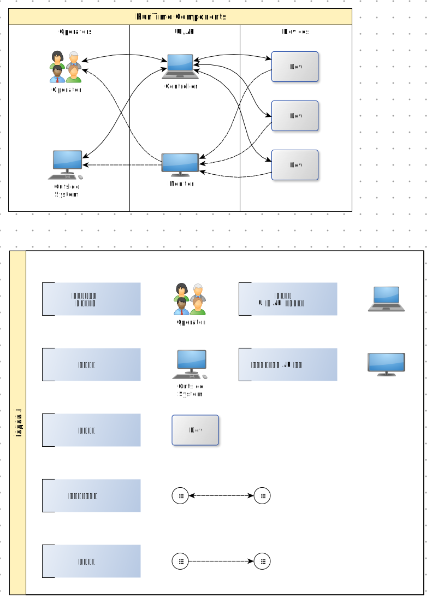
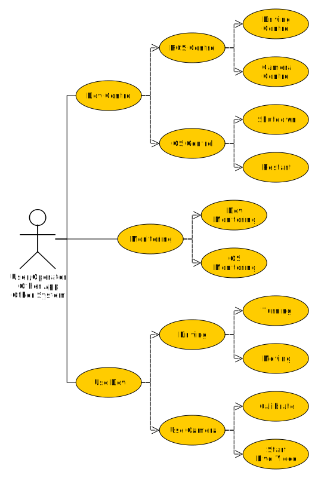

# ROS Car

用以学习、展示 ROS 系统应用的树莓派小车模型 。

## 1. 前言

开始这个项目的目的有三：

- 一是：学习 ROS 系统框架并进行实践

  ROS 是目前比较热门的系统，它的顶层框架简单，通过官方文档 [https://www.ros.org](https://www.ros.org) 两三天就可建立起相关框架概念。在了解 ROS 基础架构之后需要在实际场景中进行实践，这就是此项目的目的之所在。

- 二是：学习 Python

  虽之前零零星星看过 Python，也用之实现过小项目，但终因没有进行系统地学习与实践，以至于心中一直不认为自己已掌握此编程语言。所以想借此项目继续 Python 项目的学习。

- 三是：学习通过 github 进行代码管理与使用

  虽多年前就已经在 github 上观摩、学习各位大神的作品，但自己一直没在上面建过开源项目。所以也借此机会丰富自己的 github 技能。

此项目以概念学习为主，所以在架构设计、系统性能等方面必然有所欠缺。如大家在此方面有所要求，还请参阅其它相关项目，在此不再详述。

## 2. 项目

### 2.1. 开发准备

#### 2.1.1. 硬件

- PC 开发环境

  略

- 树莓派及相关配件

  - 树莓派 2B 及以上版本均可。如需实现无线操作，可在 Raspberry Pi 2B 上接入 USB 转 蓝牙 或 wifi 模块。为方便，也可使用自带 wifi 的树莓派版本（如：Raspberry Pi 3B 及以上）。
  - 步进电机及控制电路板。
  - 其它零配件，如 车架、摄像头固定架、设备电源、车轮等。

#### 2.1.2. 软件

- OS

  推荐使用 Linux 系统（可使用虚拟机环境）。具体安装、配置操作略。

- ROS

  Ubuntu 环境的安装、配置可参考:
  
  - [http://www.ros.org](http://www.ros.org)
  - [http://www.liuyu.com/linux/ubuntu/ros/2019/07/12/install-ros-on-ubuntu.html](http://www.liuyu.com/linux/ubuntu/ros/2019/07/12/install-ros-on-ubuntu.html)

### 2.2. 系统框架

#### 2.2.1. Top View

从最上层看， RosCar 系统如下图所示：

- 外部系统

  外部系统包括操作、管理人员以及其它系统、程序等。这部分不在本系统管理范围内。外部系统可利用本系统提供的 UI 、API 以及监控系统与本系统进行交互操作。

- 控制器：

  此部分为 ROS Car 的管理模块。对外，通过 CLI/GUI 及 API 与外部系统/人员进行交互。对内，实现对终端设备的操作与管理。

- 终端设备：

  此为 ROS Car 终端。在此项目中明确为：基于树莓派的带摄像头的可远程控制的小车。

### 2.3. Interface

#### 2.3.1. 数据链路

项目中各模块间的接口如下图所示：

- 控制器与终端的接口链路将使用 ROS 系统内部通讯机制。
- 控制器对外只提供 Unix Domain Socket(UDS) 接口。
- 依据控制器对外提供的 UDS 接口，系统将实现特定的适配器，如：基于 TCP/UDP 的网络 API 适配器等。
- 外部系统可通过适配器 或是 UDS 接口与本系统进行交互。
- 某些特殊类型数据流，如：视频流，将在特定章节中加以说明。

#### 2.3.2. 接口服务

接口对外提供的功能如下用例图所示：

## 3. 其它

### 3.1. 推荐列表

- 用 ROS 当然需要访问 ROS 官网：[https://www.ros.org](https://www.ros.org)
- 此项目中配图多为通过 yEd ([https://www.yworks.com](https://www.yworks.com)) 绘制。此工具小巧灵活，方便好用，推荐之。
- 虽然对 M$ 一直不怎么感冒，但他家可在 Linux 下使用的 VSCode 真不错：[https://code.visualstudio.com](https://code.visualstudio.com)
